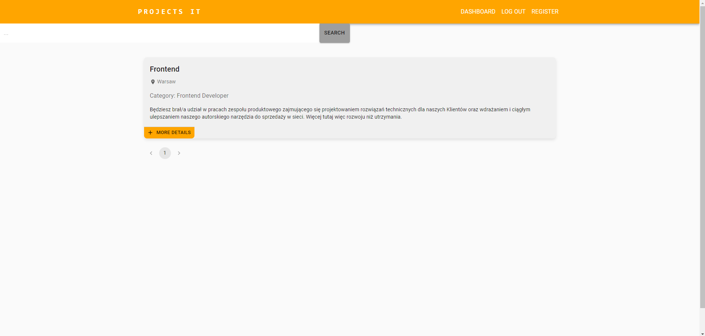
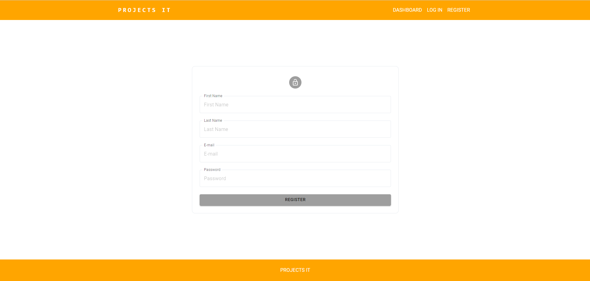
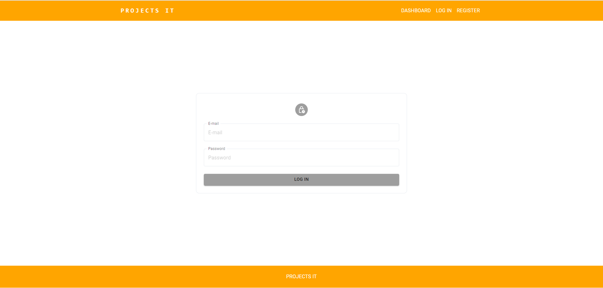
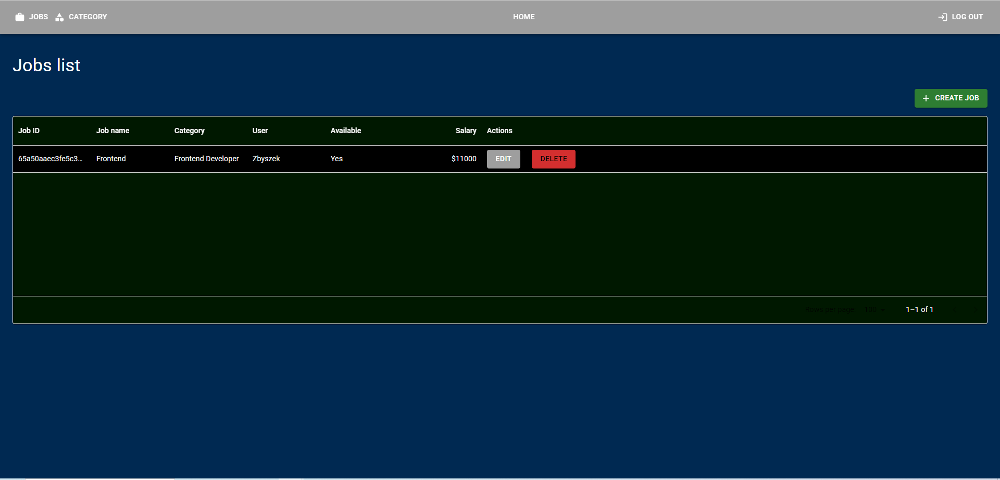
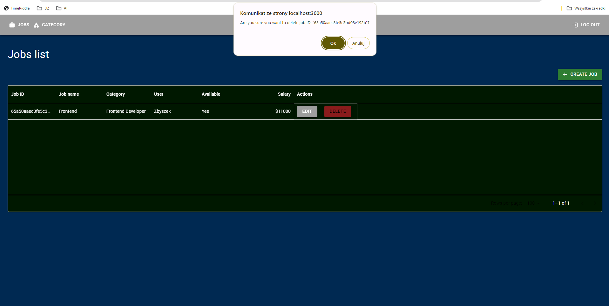
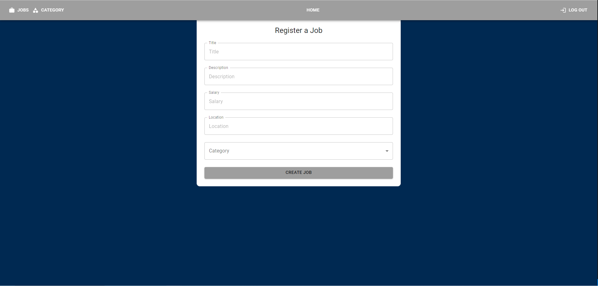

# Dokumentacja Aplikacji z ofertami pracy
 
> Aplikacja umożliwiająca składania ofert pracy IT i wyszukiwanie ich
 
## Spis Treści
* [Informacje Ogólne](#informacje-ogólne)
* [Technologie Użyte](#technologie-użyte)
* [Funkcjonalności](#funkcjonalności)
* [Zrzuty Ekranu](#zrzuty-ekranu)
* [Instalacja](#instalacja)
* [Jak Korzystać](#jak-korzystać)
* [Status Projektu](#status-projektu)
* [Twórcy](#twórcy)
 
## Informacje Ogólne
- Celem aplikacji jest pomoc w znalezieniu pracy w dziale IT
- Umożliwia użytkownikom wyszukiwanie ofert, tworzenie ofert.
- Aplikacja zawiera funkcjonalności takie jak rejestracja, logowanie, wyszukiwanie, towrzenie, edycje ofert pracy oraz usuwanie nieaktualnych ofert.
 
## Technologie Użyte
- React
- NodeJS + Express
- Moongo DB
- JAvaScript
- MUI
- Visual Studio Code
 
## Funkcjonalności
- Wyszukiwanie ofert
- Tworznie ofert
- Edycja oraz usuwanie ofert pracy
- Rejestracja oraz logowanie
 
## Zrzuty Ekranu

**Strona główna**

**Rejestracja**

**Logowanie**

**Lista prac**

**Usuwanie**

**Tworzenie oferty**

**Edycja oferty**

 
## Instalacja
Aby uruchomić projekt lokalnie:
1. Musimy przejść do katalogów forntend i backend w terminalu wpisujemy `npm install`
2. Następnie w katalogu backend wpisujemy `nodemon app.js`
3. A w katalogu frontend wpisujemy `npm start`
4. Przechodzimy do `http://localhost:3000/`
 
## Jak Korzystać
- Po rejestracji możemy przejść do logowania
- Następnie możemy utworzyć ogłoszenie, a potem mamy możliwość edycji
- Przy tworzeniu oferty możemy wybrać jedną z kilku kategori pracy w IT
- Po przejściu do zakładki Home możemy wyszukać swoje ogłoszenie
 
## Status Projektu
Projekt jest w trakcie rozwoju.
 
## Twórcy
- Projekt stworzony przez [@VVNorbi](https://github.com/VVNorbi).
